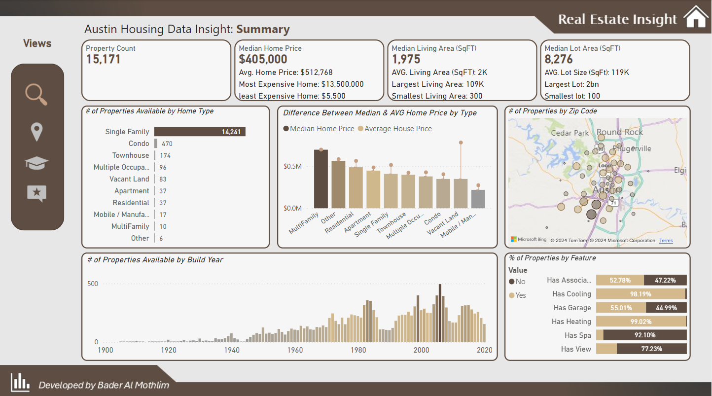
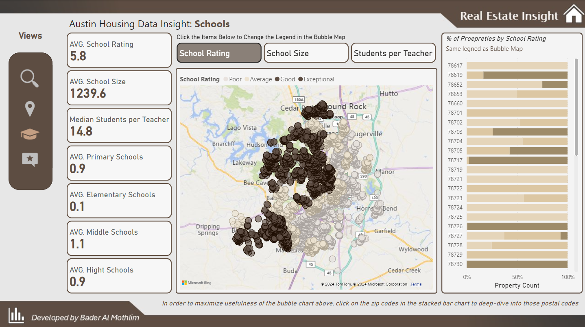
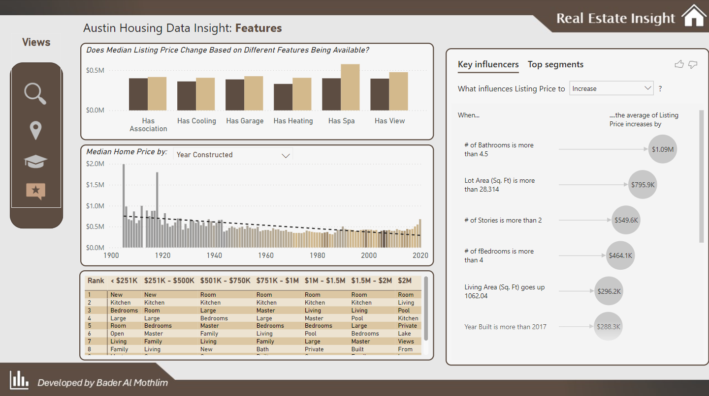

# 🏠📊 Real Estate Price Analysis Report  

This repository contains a comprehensive Power BI report analyzing the real estate market. The project aims to uncover valuable insights to assist buyers and investors in making informed decisions.

---

## 📂 Project Workflow  

1. **Data Cleaning and Transformation**:  
   - Utilized **Power Query** to preprocess and structure the data for analysis.  

2. **Advanced Metrics Development**:  
   - Created custom measures and calculations using **DAX** for detailed analysis.  

3. **Report Design and Visualization**:  
   - Built the report using **Power BI**.  
   - Designed visuals, icons, and layout with **PowerPoint** for a professional dashboard experience.  

---

## 🗂️ Report Contents  

### 1. Summary Page  
- Overview of:  
  - Total properties available.  
  - Average house prices and sizes.  
- **Map visualization** displaying property distribution by year built, highlighting market trends.  

### 2. Location Page  
- Interactive map showcasing property locations with filters for price ranges.  
- Insights on average house prices based on latitude and elevation, illustrating the impact of location on pricing.  

### 3. Schools Page  
- Analysis of nearby school quality:  
  - Average school ratings.  
  - Student-to-teacher ratios.  
- **Interactive map** showing school locations and ratings to understand education quality's effect on property pricing.  

### 4. Features Page  
- A matrix table connecting property prices with features such as:  
  - Lower-priced homes: "new kitchen," "spacious rooms."  
  - Higher-priced homes: "swimming pool," "lake views."  
- Helps assess the impact of features on pricing for better investment decisions.  

---

## 🔗 Data Source  
[Source Link](https://lnkd.in/d3YsmJms)  

---

## 🌐 Explore the Full Report  
[Click here to explore the interactive report](https://lnkd.in/d4GhsmzC)  

---

## 🚀 Purpose  
This report serves as a tool to analyze real estate market dynamics, offering actionable insights for decision-making.

Feel free to explore the repository and use the findings to support your real estate investment strategies. Contributions and feedback are welcome! 😊

